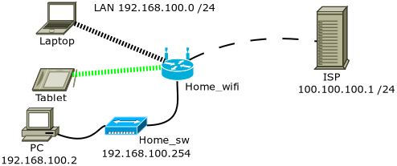

# Alapvizsga
Gyakorló alapvizsga feladat 
 
## Feladatok:

    1. Hozzon létre egy fájlt SAJARNEV néven a szimulációs program segítségével. Továbbiakban ebben a fájlban dolgozzon
    2. Válassza ki a feladatban megadott készülékeket és helyezze el a munkalapon!
    3. Kösse össze a készülékeket a topológiának megfelelően!
    4. Állítsa be a szerveren a 100.100.100.1/24 statikus IP címet!
    5. Állítsa be a szerveren a 100.100.100.2 átjáró címet!
    6. Engedélyezze a szerveren a DNS szolgáltatást!
    7. Vigye fel az alapvizsga.hu, 100.100.100.1 DNS rekordot!
    8. A HTTP szolgáltatásban töröljön minden fájl-t és töltse fel a GITHUB oldalon található három fájlt. (index.html, styles.css, script.js)
    9. Állítsa be PC0-án statikusan a 192.168.100.2/24 IP címet!
    10. Állítsa be az átjáró IP címét 192.168.100.1-re!
    11. A DNS szerver legyen az ISP szerver!
    12. Állítsa be, hogy a tablet és a laptop DHCP-vel kapjon IP címet!
    13. Állítsa be a WiFi router Internet portjának IP címét statikusan 100.100.100.2/24-re!
    14. Állítsa be a WiFi router átjárójának IP címét 100.100.100.1-re!
    15. A WiFi router LAN oldali IP címe legyen 192.168.100.1/24!
    16. Engedélyezze a WiFi routeren a DHCP-t!
    17. A WiFi router DHCP címkészletében állítson be a 192.168.100.100 címtől kezdődően 5 db IP címet!
    18. A DNS szerver legyen ISP, IP címe!
    19. A WiFi hálózat SSID-je legyen HomeLAN!
    20. Tiltsa le az SSID szórást!
    21. Állítsa be a WiFi hálózat biztonságát WPA2 Personal típusúra!
    22. A WiFi jelszó legyen HomePassw!
    23. Amennyiben több antenna is rendelkezésre áll, vagy kapcsolja ki a többit vagy mindegyiken gondoskodjon a biztonságról!
    24. Állítsa be a Laptop0 és a Tablet PCO csatlakozási profiljában a csatlakozáshoz szükséges jellemzőket!
    25. Csatlakoztassa a Laptop0-t a WiFi hálózathoz!
    26. A Laptop0 IP címéről ellenőrizze a MAC szűrést!
    27. Készítseg GUEST hálózatot a Tablet számára.
    28. A Guest wifi jelszava HomeGuest legyen,
    29. Gondoskodjon arról, hogy a Guest hálózat kliensei ne érjék el a lokális hálózat erőforrásait.
    30. Állítsa be a switch készüléknevét SW_2960 -ra!
    31. Állítsa be, hogy a neve legyen "Maganalohaz"!
    32. Állítsa be a switch VLAN 1 távfelügyeleti IP címét 192.168.100.254/24 -re!
    33. Állítsa be a switch átjáróját 192.168.100.1 -re!
    34. Állítsa be a switch CLI jelszavát alapvizsgacli -re!
    35. Állítsa be a switch enable üzemmódjának jelszavát alapvizsgaena -ra!
    36. Állítson be a switch eszközön napi üzenetet „Alapvizsga belepes!”
    37. Mentse el a beállításokat, hogy áramtalanítás után is megmaradjon a konfiguráció!
    38. Állíts át a Homerouter jelszavát ’admin’-ról a MyRouter123 jelszóra.
    39. Mentse el a Laptop eszközre a router konfigurációt.
    40. Tesztelje a hálózati kapcsolatokat ping segítséglével.
